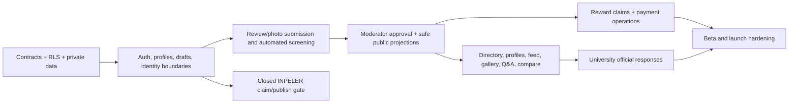

# INPOLOR — Implementation Plan to Public Launch

**Goal:** Deliver the approved [public-launch product specification](./INPOLOR_PUBLIC_LAUNCH_PRODUCT_SPEC.md) by **30 November 2026**, with a real 30-person closed beta beginning approximately **9 November 2026**.

**Delivery capacity:** founder-led, 4 hours/day, 7 days/week (about 432 hours before launch), assisted by Codex. No development contractor.

**Scope rule:** every capability in the approved specification is a launch requirement. Any newly proposed feature must be explicitly traded against schedule/capacity; it must not enter silently.

---

## 1. Starting point and strategy

`apps/portal-parent` is the current INPOLOR prototype. It already has a React/Vite app, a three-route shell (`/`, `/submit-review`, `/quick-review`), local-storage recovery, magic-link UI, an anonymous-submission payload path, and a safe public `published_reviews` projection. It is not yet the required public product: its review schema is one 1–5 rating with a small JSON payload; its quick-review gate is lightweight; its review data can fall back to device-only mode; and it has no real account, moderator, reward, gallery, Q&A, comparison, or institution-response workflows.

The implementation must turn the prototype into a **server-authoritative community system**. Do this in dependency order:

The key architecture rule remains unchanged: frontend apps import the single shared client and database types from `@repo/database`; they never create a Supabase client or use privileged credentials.

## 2. Delivery principles

1. **Database and security before UI.** Build migrations, private/public projections, typed contracts, RLS policies, and server operations before a page depends on them.
2. **No browser-authoritative publication, moderation, payment, age, or fraud state.** Browser storage is limited to a recoverable draft and UI preference; it never proves eligibility.
3. **Projection, not broad reads.** `public.reviews`, claims, fraud signals, raw user metadata, and source photos remain unavailable to public and university-representative roles. Public pages read only explicit safe projections/RPC payloads.
4. **Automated screening is advisory; manual moderation is decisive.** A screening result can request correction but cannot publish or pay a review.
5. **Build a vertical slice before breadth.** First prove one review can pass from draft → authenticated submission → redacted media → moderator approval → safe public page → reward claim. Then add discovery and community surfaces.
6. **Test every protected operation.** Every new role, RPC, projection, storage path, and state transition gets contract/RLS tests before UI claims it works.

## 3. Workstreams and ownership

| Workstream | Owner | Output |
| --- | --- | --- |
| Product and operational decisions | Founder | Seed-institution list, moderation decisions, campaign content, payment execution, legal review instructions. |
| Application, database, tests, and documentation | Founder with Codex | Source changes, migrations, typed contracts, unit/component/DB/browser tests. |
| Legal approval | Malaysian lawyer | Final terms, privacy notice, reward terms, UGC/moderation policy, retention and external-AI review. |
| Vendor accounts | Founder | Supabase, hosting, email, AI/redaction vendor, error monitoring, domain, TNG payment process. |
| Content moderation and payments | Founder initially | Content and payment queues, campaign budget, report decisions. |

## 4. Architecture and data-contract plan

### 4.1 Existing contracts to preserve

- `packages/database` remains the only client/type boundary.
- `reviews` plus the `published_reviews` projection pattern stays the base for safe public review reads.
- Existing university/course/institution assets remain shared contracts used by INPELER and INPOLOR.
- Existing anonymous scrubbing, local-storage error handling, cookie consent, and route fallback behaviour remain covered by regression tests until deliberately replaced.

### 4.2 New private data domains

Create explicit, access-controlled tables/types rather than overloading `reviews.review_data` with security state:

| Domain | Required records | Visibility |
| --- | --- | --- |
| Community account | DOB, language preference, accepted-policy timestamps, account status | owner + restricted admin only |
| Review lifecycle | immutable submission/version, all eight ratings, structured answers, status, moderator decision/correction reason | author + content moderator; approved safe subset public |
| Review media | category, redacted storage object, scan/redaction status, contributor confirmation, selection score | author + content moderator; selected safe subset public |
| Moderation | automated-screen result, manual action, audit trail, *Unspoken Truth* classifications | moderators only |
| Community interaction | comments, Q&A, three-level parent relation, reaction/upvote, saves, reports | author/moderation/private; approved projections public |
| Reward | eligibility state, private TNG number, claim status, payment reference, dispute record | owner + payment moderator/admin only |
| Fraud/risk | account/eWallet uniqueness result, IP/device/timing/content risk signals and outcome | restricted moderator/admin only |
| Notifications | in-app event/read state and transactional email audit | owner + service/admin only |
| University response | claim approval, official-response draft/status/audit | university author + content moderator; approved safe subset public |
| Operations | campaign budget/state, UTM attribution, dashboard aggregates | admin only |

Use a private schema for privileged records/functions where practical. Exposed public-schema tables require RLS and least-privilege grants; public views must not accidentally bypass RLS. Do not use user-editable auth metadata as an authorization decision.

### 4.3 Server operations

Design narrow, authenticated RPC/Edge operations for:

1. account/DOB creation and immutable-age check;
2. submit and resume a review draft;
3. upload intake, EXIF stripping/redaction orchestration, and contributor confirmation;
4. automated pre-screen result and correction request;
5. manual content moderation action;
6. safe public-projection refresh;
7. toggle like/upvote/save;
8. submit threaded comment/Q&A/report;
9. report-driven hide and moderator restore/remove decision;
10. unlock *Unspoken Truths* on full-review submission;
11. reward eligibility, claim creation, payment completion, and payment dispute;
12. university claim verification and official-response submission;
13. in-app notification creation/read state;
14. admin dashboard aggregates and campaign status.

Every function validates the caller and resource ownership, has minimal grants, and receives direct tests for authorised and unauthorised paths.

### 4.4 Storage and redaction pipeline

1. Client accepts JPEG/WebP/PNG up to 5 MB only.
2. The server receives the temporary object in a non-public intake location; browser code never writes a public object URL.
3. The processing worker strips EXIF, detects sensitive identifiers, produces a redacted derivative, and records the result.
4. The contributor reviews/accepts the derivative.
5. Only the accepted redacted derivative is promoted to the approved private/public-safe storage location. Delete the original intake file.
6. Public gallery projections expose only approved redacted media with no identity or storage-path leakage.

Vendor selection for detection/redaction is a prerequisite. The implementation must include failure/retry paths, contributor correction, malware/content-type checks, file-size checks, and tests for originals not becoming public.

## 5. Page and workflow backlog

### 5.1 Public and community pages

| Surface | Deliverables | Depends on |
| --- | --- | --- |
| Home/directory | Campaign CTA, institution/course search, rating/cost filters, four sort modes, limited-data presentation, UTM capture | public institution/aggregate projection |
| Institution profile | Header score, eight ratings, strengths/weaknesses, feed, cost, Q&A, gallery, basic facts, official replies | review/media/Q&A projections |
| Review card/feed | Anonymous course/year display, complete badge, save, like, report, text comment tree | review lifecycle + interaction projection |
| Review wizard | Five steps, background, all eight ratings, standard/reward conditions, drafts, auth-before-submit, consent copy | auth, submission RPC, course list |
| Unspoken Truths | blurred teaser, full-review gate, persistent platform-wide unlock, moderator-approved low-score excerpts | full-review state + classification projection |
| Compare | logged-in, max three institutions, limited-data state, saved comparison set | aggregate projection + saves |
| Auth/account | email magic link, Google, DOB/18+ gate, language selection, account settings | account profile contract |
| My reviews | draft/status list, correction/edit lifecycle, reward and unlock status | author-safe lifecycle projection |
| Saved/notifications | three saved tabs, in-app event list/read state | saves + notifications |
| RM10 claim | secure eWallet capture, ownership confirmation, status, receipt reference, payment-problem form | reward contract + role gate |
| Support/privacy | in-app support form and privacy fallback | support/retention contract |

### 5.2 Internal and INPELER surfaces

| Surface | Deliverables | Depends on |
| --- | --- | --- |
| Content moderator dashboard | seven queues, bulk-safe actions, audit history, photo review, classification editor | moderation contracts and roles |
| Payment dashboard | claim queue, safe eWallet view, payment reference entry, dispute queue | reward roles/RLS |
| Admin dashboard | acquisition funnel, queue age, institution coverage, budget, reports, media outcomes | operations aggregates |
| INPELER closed claim/publish workflow | full institution profile/course/facility/assets/attestation completion and admin approval | existing INPELER flow plus claim state |
| Official-response tools | review reply, Q&A reply, profile statement; content-moderated publication | verified institution role + public response projection |

### 5.3 Exact product rules to test

- one active review per account per institution; edits are moderated versions;
- all eight 1–10 ratings required, equal weight, arithmetic mean, one decimal;
- standard review: institution/course/year/eight ratings/one substantive written answer;
- reward review: mandatory structured answers, 30-word narratives, 3 food names, RM300–RM10,000 monthly cost, and 2–5 photos in each of eight categories;
- reward: one RM10 lifetime per person/eWallet, campaign status visible, payment only after approval;
- rating visible from one review but labelled limited under five; directory ranking needs five; cost/strengths need five qualifying records;
- comments/Q&A are text-only, three levels, manually approved; likes/upvotes reversible and no downvotes;
- one report hides public content immediately and produces a neutral placeholder;
- *Unspoken Truths* only from moderator-approved excerpts of total-score <=4.0/10;
- university representatives have no sensitive reviewer access and official responses require completed/approved INPELER status;
- only redacted/metadata-stripped images are retained;
- public UI has BM and English, mobile-first layouts, and WCAG 2.2 AA checks.

## 6. Milestone plan

Dates are delivery targets. A milestone is not complete until its test gate passes.

### Milestone 0 — 14–23 August: decisions and safe foundation

- Freeze this plan and the product specification as scope source of truth.
- Select/red-team the AI redaction/moderation vendor; create non-production vendor accounts and a spend cap.
- Obtain the first 20 qualifying Kuala Lumpur/Selangor institution seed list and course/fact source records.
- Define final role matrix, private/public data inventory, retention schedule, campaign terms inputs, and precise moderation reason catalogue.
- Create a feature branch and baseline current tests/builds.
- Produce the migration/schema plan and test matrix before editing feature code.

**Gate:** no secrets in source; target entities/data owners are defined; data-flow/RLS design reviewed; baseline tests are captured.

### Milestone 1 — 24 August–13 September: secure contracts and vertical slice

- Add migrations/private-schema tables/types for account DOB, review versions, media, moderation audit, reward, and safe public projections.
- Extend `@repo/database` contracts, source-safe RPC types, database contract tests, RLS tests, and rollback files.
- Implement account creation/age gate, auth callback/draft recovery, author-safe review status, and language persistence.
- Implement one end-to-end vertical slice: authenticated standard review → moderator approval → anonymous public review card.

**Gate:** browser cannot publish directly; public projections cannot expose identity; owner/moderator/representative isolation tests pass; vertical slice works on mobile.

### Milestone 2 — 14 September–4 October: complete contribution and reward workflow

- Build five-step wizard and all validation/correction states.
- Implement secure media intake, EXIF stripping, redaction confirmation, approved derivative retention, and deletion of originals.
- Add full-review unlock, *Unspoken Truth* candidate classification/review state, and author edits/versioning.
- Build content moderator queues and payment claim workflow, including one-lifetime reward checks, private eWallet storage, transaction reference, and dispute form.
- Add campaign budget/status and UTM attribution intake.

**Gate:** test data proves the standard/reward branches, 16–40 photo bounds, correction loop, no-original retention, unlock persistence, and paid-claim lifecycle.

### Milestone 3 — 5–25 October: discovery and community product

- Build directory, 20-institution seed import/admin flow, search, filters, sort, confidence labels, and aggregate calculations.
- Build institution profiles, rating/cost/strength projections, review feed/card, gallery selection, and comparison.
- Build saves, reactions, reports, threaded comments, Q&A, notifications, and support flows.
- Build responsive BM/English experience and accessibility coverage.

**Gate:** all public/community page workflows work against safe server data; report hides content immediately; no unauthorised interaction is published; desktop and mobile browser journeys pass.

### Milestone 4 — 26 October–8 November: institution response and beta readiness

- Complete the closed INPELER institution-completion/attestation/admin-approval gate.
- Add official replies in all three locations and route every reply through content moderation.
- Finish admin analytics, operational dashboards, audit records, campaign-budget visibility, and error monitoring.
- Run full RLS, typecheck, lint, unit, database-contract, browser, responsive, performance, and accessibility test passes.
- Complete legal review; publish final bilingual legal/support pages; prepare beta instructions and payment process.

**Gate:** beta release candidate; all high-risk data flows tested; legal sign-off received; no P0/P1 defects open.

### Milestone 5 — 9–29 November: real closed beta and release hardening

- Invite 30 participants from reachable campuses; use real login, real content, real redaction, real moderation, and real RM10 payment.
- Daily triage queue, defects, audit logs, conversion funnel, payment exceptions, and abuse attempts.
- Pass beta criteria: at least 20 independent completions, working draft/auth recovery, no identity leak, safe media pipeline, and at least one paid/recorded claim.
- Fix validated defects only; do not add new scope.
- Re-run full release suite and production configuration checks.

**Gate:** go/no-go review on 29 November with evidence; public launch on 30 November if every release gate passes.

## 7. Verification plan

### Database/RLS

- pgTAP and integration cases for every table, projection, RPC, function grant, role, version, storage path, and unique/retention rule.
- Explicit negative tests: visitor/public, community user, author, another user, university representative, content moderator, payment moderator, and primary admin.
- Verify no service-role key in frontend code or public environment variables.

### Application

- Unit tests for all validation, score calculation, campaign state, limited-data thresholds, status transitions, language selection, drafts, and anti-duplicate conditions.
- Component tests for wizard, all account states, photos, gates, reports, queues, comparison, empty/error states, and accessibility labels.
- Browser workflows on 320px, 768px, 1024px, and 1440px with fresh user contexts.
- Browser checks include refresh/recovery, invalid routes, malformed IDs, duplicate submissions, failed network calls, console errors, and repeated interactions.

### Security/privacy

- Public response payload snapshots prove no email/user ID/DOB/eWallet/IP/device/original-media metadata leaks.
- Attempt cross-account read/update, duplicate reward, duplicate eWallet, forged moderator action, forged official reply, direct-storage access, and report abuse.
- Confirm only redacted image variants are public and EXIF is absent.

### Operational

- Manual dry run: approve/reject/correct review, classify *Unspoken Truth*, hide/restore reported content, pay reward, log payment issue, approve institution, publish official response, process deletion/privacy request.
- Check dashboard calculation against fixtures for UTM source, queue age, campaign budget, and institution coverage.

## 8. Risks and controls

| Risk | Control / owner |
| --- | --- |
| 432-hour solo capacity is exceeded | Strict dependency order, vertical slices, daily scope review; no silent feature additions. |
| 16–40 photo reward submissions overwhelm storage/moderation | enforce bounds and redaction pipeline; monitor media volume/budget; use queue age dashboard. |
| Public harm, defamation, or privacy leak | automated pre-screen + manual approval + immediate report hide + legal review. |
| Reward fraud | account/eWallet uniqueness, risk scoring, manual payment release, audit record, 24-month retention. |
| Universities pressure moderation | role isolation, all official replies moderated, report procedure applied consistently. |
| Beta misses critical workflow flaws | real 30-person beta, real payments, daily triage, no feature expansion after beta begins. |
| Vendor/API failure | non-production proof first, retry/error states, no public original media, contingency budget, documented fallback. |
| Legal sign-off delays launch | engage counsel during Milestone 0; do not defer legal inputs to beta week. |

## 9. Immediate next actions

1. Turn this plan into an implementation backlog ordered by Milestone 0 → 1 vertical slice.
2. Inspect and document the current migrations, types, policies, and INPELER flow before proposing schema changes.
3. Choose the AI redaction/moderation vendor and define its data-processing/retention contract with legal counsel.
4. Prepare the 20-institution seed list and the 30-person beta recruitment list.
5. Create the initial security/data migration and its tests only after steps 1–3 are confirmed.

No production deployment, migration push, credential change, or vendor purchase is authorised by this plan alone.
