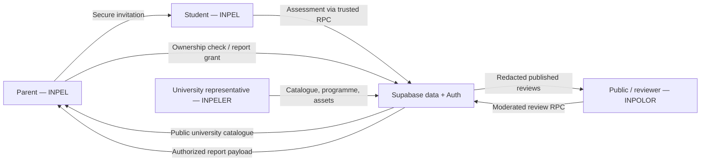
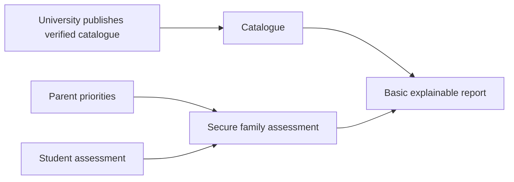

# PRD Semasa — Ekosistem INPEL / Agency Web

**Status dokumen:** Audit keadaan sebenar repositori  
**Tarikh kemas kini:** 16 Ogos 2026  
**Bahasa:** Bahasa Melayu  
**Sumber kebenaran:** Kod, migrasi, ujian, blueprint, dokumen operasi, fail konfigurasi, dan bukti browser dalam repositori  
**Keputusan release semasa:** **NO-GO untuk production** — asas keselamatan, katalog dan legal telah diperkukuh, tetapi bukti staging semasa, operasi moderation dan kelulusan legal production masih belum lengkap.

---

## 1. Ringkasan eksekutif

Ini bukan lagi sebuah “agency website”. Produk yang sedang dibina ialah sebuah **platform pendidikan tiga sisi** untuk keluarga, pelajar, dan universiti, dengan satu lapisan komuniti ulasan serta infrastruktur data dan keselamatan bersama.

Platform ini mempunyai tiga produk pengguna:

1. **INPEL** — perjalanan keluarga untuk memilih universiti:
   - parent mencipta jemputan;
   - student menjawab assessment;
   - sistem mengawal penyerahan assessment melalui akaun dan token;
   - parent mengaktifkan akses laporan;
   - sistem memaparkan laporan yang diluluskan oleh server.
2. **INPELER** — portal penerbitan universiti:
   - wakil universiti mengurus profil institusi;
   - menambah programme, yuran, akreditasi, bantuan kewangan dan outcome;
   - mengurus logo/facility assets;
   - membuat attestation dan menerbitkan data.
3. **INPOLOR** — komuniti ulasan pelajar:
   - orang awam membaca ulasan yang sudah ditapis;
   - reviewer menghantar ulasan biasa atau anonymous;
   - moderation berlaku melalui server;
   - “Unspoken Truths” dibuka melalui quick-review gate.

Di bawah ketiga-tiga produk ini terdapat:

- Supabase Auth;
- kontrak table, view dan RPC TypeScript yang dikemas kini bersama migrasi;
- trusted database functions/RPC;
- Row Level Security dan role-based access;
- storage bucket untuk aset universiti;
- moderation dan rate limiting ulasan;
- local-first draft recovery;
- cookie consent;
- legal/privacy workstream;
- staging integration audit;
- CI, database tests, browser evidence, dan release runbook.

### Jawapan terus kepada kebimbangan “terlalu kompleks”

**Ya, terlalu kompleks jika semuanya dianggap satu MVP yang mesti dilancarkan serentak.**  
**Tidak, terlalu kompleks jika ia dipisahkan sebagai tiga produk dan dibina berfasa.**

Kompleksiti bukan datang daripada UI sahaja. Ia datang daripada gabungan:

- multi-role authentication;
- parent–student invitation ownership;
- data sensitif seperti household income dan psychometric answers;
- university publishing dan asset ownership;
- anonymous community content dan moderation;
- perbezaan antara local/demo state dengan cloud-authoritative state;
- security/RLS;
- legal dan operasi production;
- blueprint lama yang masih wujud bersama seni bina baharu.

Cadangan produk dokumen ini ialah: **jadikan INPELER → katalog universiti → INPEL secure assessment/report sebagai laluan teras; tangguhkan community growth features INPOLOR, real payment, automated matching, comments/likes, advertising tracking dan PDF-rich report sehingga asas teras stabil.**

---

## 2. Skop audit dan definisi “semua fail”

Repositori mengandungi **29,280 entri fail yang dapat diinventori melalui filesystem**, termasuk dependency, cache, sejarah Git dan output generated.

Audit produk menggunakan dua lapisan:

1. **344 fail unik milik projek yang wujud ketika audit bermula** diperiksa dan diklasifikasikan:
   - source code;
   - tests;
   - SQL migrations/rollback/pgTAP;
   - blueprints;
   - legal/release documents;
   - configs dan workflows;
   - generated builds;
   - browser logs/snapshots/screenshots;
   - root planning dan operational files.
2. Kategori besar yang bukan source-of-truth produk turut diaudit sebagai kategori:
   - `node_modules` — dependency pihak ketiga;
   - `.pnpm-store` — package cache;
   - `.turbo` — build/test cache;
   - `.git` — sejarah dan Git metadata.

Nilai `.env` tidak disalin ke dokumen ini. Hanya nama pemboleh ubah dan cara ia digunakan diperiksa untuk mengelakkan kebocoran credential.

Inventori fail penuh dan kaedah pemeriksaan berada dalam `docs/PRD_FILE_COVERAGE.md`. Dua dokumen PRD yang dihasilkan oleh audit ini tidak termasuk dalam angka baseline 344; manifest turut merekod PRD utama selepas ia dicipta.

---

## 3. Masalah pengguna yang hendak diselesaikan

### 3.1 Masalah keluarga

Keluarga Malaysia sukar membandingkan universiti berdasarkan gabungan:

- kemampuan kewangan;
- lokasi;
- gaya pembelajaran;
- personaliti dan minat student;
- campus environment;
- akreditasi dan outcome;
- bias marketing universiti;
- uncertainty tentang kerjaya.

### 3.2 Masalah student

Student memerlukan:

- cara menyatakan siapa diri mereka selain result peperiksaan;
- assessment yang resumable;
- shortlist yang boleh dijelaskan;
- kos, biasiswa dan career context;
- pandangan sebenar daripada student lain;
- kawalan privasi apabila berkongsi pengalaman.

### 3.3 Masalah universiti

Universiti memerlukan satu workspace untuk:

- menjaga profil institusi;
- menyusun programme dan MQA code;
- menerbitkan yuran dan bantuan kewangan;
- menunjukkan facilities dan assets;
- menyatakan graduate outcomes;
- memastikan maklumat telah di-attest sebelum public.

### 3.4 Masalah platform

Platform perlu memastikan:

- seorang parent tidak boleh melihat keluarga lain;
- student hanya boleh claim invitation yang sah;
- reviewer anonymous tidak terdedah;
- representative universiti tidak boleh mengurus aset universiti lain;
- browser state tidak boleh membuka laporan atau memalsukan pembayaran;
- public hanya membaca data yang memang selamat untuk public.

---

## 4. Visi produk

**INPEL ialah decision-support ecosystem yang menyatukan data institusi, profil student, prioriti keluarga dan pengalaman komuniti untuk membantu keluarga membuat keputusan universiti dengan lebih jelas dan selamat.**

Platform bukan:

- penasihat admission rasmi;
- jaminan pekerjaan atau gaji;
- assessment psikologi klinikal;
- jaminan biasiswa;
- marketplace pembayaran yang siap;
- ranking universiti rasmi;
- pengganti semakan terus dengan universiti/MQA.

---

## 5. Produk, pengguna dan role

| Produk | Folder sebenar | Nama workspace | Pengguna utama | Tugas utama |
|---|---|---|---|---|
| INPEL | `apps/portal-universiti` | `@repo/portal-universiti` | Parent, student | Jemputan, assessment, secure handoff, laporan |
| INPELER | `apps/portal-student` | `@repo/portal-student` | University representative, admin | Profil, programme, assets, review, publish |
| INPOLOR | `apps/portal-parent` | `@repo/portal-parent` | Public, student/reviewer | Baca, filter, submit review, quick unlock |

Nama folder `portal-student` dan `portal-parent` ialah nama legacy yang mengelirukan. Ia tidak menggambarkan produk sebenar dan tidak patut digunakan untuk membuat andaian produk.

### Role sistem

| Role | Keupayaan yang dimaksudkan |
|---|---|
| Anonymous | Baca katalog/public review projection; hantar moderated anonymous review melalui RPC terhad |
| Parent | Cipta/revoke jemputan keluarga; akses session sendiri; grant/read report sendiri |
| Student | Claim invitation yang sepadan; lengkapkan assessment sendiri |
| University representative | Publish/manage university, programme, gallery dan storage path milik sendiri |
| Admin | Akses istimewa yang sempit melalui private admin check |
| Service role | Setup/cleanup integration audit sahaja; tidak boleh muncul dalam browser |

---

## 6. Peta ekosistem

---

## 7. PRD Produk A — INPEL

### 7.1 Objektif

Membolehkan parent dan student membina satu university decision profile bersama tanpa membenarkan browser state, orang luar atau akaun salah mengambil alih session.

### 7.2 Route

| Route | Tujuan semasa |
|---|---|
| `/` | Parent authentication, family profile dan invitation creation |
| `/email-notification/:id` | Preview invitation email |
| `/student/:id?token=...` | Student assessment dan authentication |
| `/auth/callback?sessionId=...&token=...` | Restore draft selepas auth redirect dan lengkapkan secure save |
| `/parent/:id` | Parent ownership gate dan handoff selepas assessment |
| `/checkout/:id` | Aktivasi free demo report; tiada payment |
| `/results/:id` | Server-authorized report payload |
| `/guide/:guideId` | Scholarship checklist static/local |
| unknown/malformed route | Redirect ke `/` |

### 7.3 Parent journey

1. Parent isi family priorities dan kategori umur student dalam draf browser sementara:
   - preferred study location;
   - monthly household income;
   - student email;
   - campus vibe;
   - campus concern;
   - ultimate family win;
   - student independence/support level;
   - kategori umur `15–17` atau `18+`.
   Jika student berumur 15–17, parent/penjaga yang sah mesti mengesahkan deklarasi consent sebelum jemputan boleh dicipta.
2. Parent sign up atau log in dengan email/password, Google, atau Facebook. Account email yang belum confirmed tidak boleh mencipta invitation.
3. Sistem memulihkan draf hanya pada browser/device yang sama dan meminta parent mengesahkan `Continue as [email]?`.
4. Server RPC `create_parent_student_invitation`:
   - mengesahkan current user;
   - mencipta/menjaga parent profile;
   - mencipta session;
   - mencipta hashed invitation binding;
   - memulangkan session ID, raw invitation token dan expiry.
5. Browser menyimpan session draft yang telah divalidasi.
6. Parent copy link, preview email, atau revoke invitation.

### 7.4 Student journey

1. Student buka session UUID bersama opaque invitation token.
2. Jika browser tidak mempunyai parent draft, ia membuat temporary student-only session draft.
3. Student lengkapkan:
   - 16 Likert personality questions;
   - 5 psychometric sliders;
   - 1–20 SPM subject/grade rows tanpa duplicate subject;
   - 6 Vibe Check choices.
4. Progress disimpan secara local selepas setiap peringkat.
5. Sebelum password/OAuth redirect, sistem menyimpan authentication draft versi 1:
   - TTL 24 jam;
   - termasuk full assessment;
   - tidak termasuk password atau provider token.
6. Student sign up/login atau OAuth Google/Facebook.
7. Callback:
   - restore draft;
   - sahkan cloud user;
   - claim token;
   - pastikan claimed session sama dengan route;
   - complete assessment melalui RPC;
   - save completed local session;
   - clear auth draft;
   - redirect ke parent handoff.
8. Jika cloud write gagal, draft kekal untuk retry.

### 7.5 Parent report access

1. Parent route sentiasa melalui ownership gate.
2. Account mesti role `parent` atau `admin`.
3. RLS mesti membenarkan session itu sahaja.
4. “Checkout” semasa ialah **free demo activation**, bukan transaksi.
5. RPC `grant_demo_report_access` memberi server-side grant.
6. `/results/:id` memanggil `get_authorized_report`.
7. Local storage, fake payment state atau URL sahaja tidak boleh membuka report.

### 7.6 Input dan validation

- Parent/student email mesti menyerupai email valid.
- Password minimum 8 aksara.
- Location mesti daripada senarai negeri/wilayah Malaysia atau “Open to anywhere”.
- Income mesti daripada enam band yang ditetapkan.
- Semua empat parental preferences wajib.
- Kategori umur student wajib. Bagi umur 15–17, consent parent/penjaga wajib dan direkod oleh server bersama masa serta teks deklarasi yang diterima.
- Semua 16 personality answers wajib dan dalam nilai 1–5.
- Psychometric score dalam 0–100.
- Sekurang-kurangnya satu SPM subject; maksimum 20.
- Subject mesti dalam senarai SPM dan tidak boleh duplicate.
- Grade: `A+`, `A`, `A-`, `B+`, `B`, `C+`, `C`, `D`, `E`, `G`.
- Semua enam Vibe Check answers wajib.
- Semua session ID mesti UUID.

### 7.7 Data yang dikumpul

- Parent email.
- Student email.
- Location.
- Monthly household income.
- Empat parental preferences.
- Kategori umur student dan, bagi student 15–17, rekod deklarasi consent penjaga.
- 16 personality answers.
- Lima psychometric values.
- SPM subjects dan grades.
- Enam Vibe Check answers.
- Derived career suggestion labels.
- Authentication provider dan timestamps.
- Session, binding, assessment dan report grant lifecycle.

### 7.8 Status implementasi INPEL

| Keupayaan | Status |
|---|---|
| Parent auth + secure invitation RPC | Dibina |
| Age-band + guardian consent server-authoritative untuk student 15–17 | Dibina |
| Invitation expiry/revoke/claim | Dibina dalam DB/RPC |
| Resumable multi-part student assessment | Dibina |
| OAuth/email callback recovery | Dibina |
| Parent ownership gate | Dibina |
| Server-authorized demo report | Dibina |
| Real payment gateway | Tidak dibina |
| Automated matching engine | Tidak dibina/proven |
| Production recommendation generation | Tidak dibina/proven |
| Rich ROI/career UI | Kod wujud tetapi tidak dipasang pada route semasa |
| PDF report | Komponen wujud tetapi tidak dipasang pada report semasa |
| Scholarship guide | Dibina sebagai panduan static/local |
| Bahasa dan accessibility shell | Dibina sebahagian: Bahasa Melayu ialah default yang disimpan; English, Tamil dan Chinese tersedia pada komponen yang telah diterjemah. Liputan penuh semua copy masih perlu diaudit. |

### 7.9 Komponen dormant/legacy dalam INPEL

Fail berikut menggambarkan produk keputusan yang lebih besar tetapi tidak digunakan oleh `Results` semasa:

- `ROICalculator`;
- `CareerProgressionDashboard`;
- `LocationMap`;
- `PdfReportDialog`;
- `fallbackMatches`;
- `mapUniversityRows`;
- `calculateRoi`.

Ini bermaksud repositori mempunyai **dua definisi report**:

1. blueprint/legacy rich matching report; dan
2. current secure, minimal, server-authorized report.

Product owner perlu memilih satu direction sebelum menambah feature.

---

## 8. PRD Produk B — INPELER

### 8.1 Objektif

Membolehkan wakil institusi yang disahkan menerbitkan data universiti dan programme yang akan digunakan oleh platform lain.

### 8.2 Route

| Route | Tujuan |
|---|---|
| `/login` | Institutional representative sign-in |
| `/dashboard/global-profile` | Profil, contacts, facilities, logo/facility assets, gallery |
| `/dashboard/courses` | Programme list |
| `/dashboard/courses/form` | Add programme |
| `/dashboard/courses/form?course=:id` | Edit programme draft |
| `/dashboard/review` | Review, blockers dan accuracy attestation |
| `/dashboard/success` | Cloud publish result atau development-only preview result |

### 8.3 Authentication dan authorization

- Supabase email/password auth.
- Profile mesti role `university_rep` atau `admin`.
- Refresh menggunakan `auth.getUser()`, kemudian memeriksa role.
- Unauthorized user di-sign-out.
- Dashboard route dilindungi.
- Demo bypass hanya dibenarkan dalam development atau explicit non-production verification mode.
- Password kekal dalam form state dan dibuang selepas sign-in.

### 8.4 Institution profile

Data:

- institution name;
- city/state;
- campus address;
- official website;
- contact email;
- contact phone;
- logo URL atau pending logo file mengikut versi UI;
- tuition fee;
- acceptance rate;
- enam facility flags:
  - 24-hour library;
  - specialist laboratories;
  - on-campus accommodation;
  - sports and recreation centre;
  - career development centre;
  - student counselling services;
- optional facility images;
- gallery category dan public URL.

Draft disimpan pada `inpeler:institution-draft:v1` dan di-validate ketika load.

### 8.5 Programme editor

#### Academic

- course name;
- faculty/school;
- MQA accreditation code;
- study mode;
- student-to-lecturer ratio;
- dual-award degree;
- interview/portfolio required;
- minimum entry requirements;
- document checklist;
- micro-credentials;
- professional body exemptions;
- industry advisory boards.

#### Financial aid

- total base tuition fee;
- registration fee;
- cost per credit hour;
- additional material cost;
- PTPTN approved;
- MARA eligible;
- state Zakat/Yayasan eligible.

#### Outcomes

- graduate employability rate;
- internship duration;
- on-time graduation rate;
- top hiring companies/industry partners.

MQA validation copy yang perlu kekal tepat:

`MQA Accreditation Code is required.`

### 8.6 Publish flow

1. Validate institution profile.
2. Validate setiap programme.
3. Block jika tiada programme.
4. Block jika accuracy attestation belum dipilih.
5. Cegah double submission.
6. Sahkan current authenticated user.
7. Insert university record.
8. Upload pending logo/facility images ke `university-assets`.
9. Path wajib:
   - representative ID;
   - university ID;
   - asset kind;
   - generated UUID;
   - safe extension.
10. Link public URLs kepada university record.
11. Insert gallery rows.
12. Insert course rows.
13. Jika mana-mana langkah gagal:
   - remove uploaded objects;
   - delete university record;
   - cascade membersihkan child rows;
   - laporkan cleanup failure dengan jelas.

### 8.7 Asset rules

- PNG, JPEG, WebP sahaja.
- Maksimum 5 MB.
- Original filename tidak digunakan sebagai storage path.
- URL mesti daripada configured Supabase project dan bucket `university-assets`.
- Representative hanya boleh mengurus path yang dimilikinya.
- Public bucket listing tidak sepatutnya dibenarkan.

### 8.8 Status implementasi INPELER

| Keupayaan | Status |
|---|---|
| Auth + role guard | Dibina |
| Draft auto-save | Dibina |
| Institution fields | Dibina |
| Programme editor | Dibina |
| Validation dan publish blockers | Dibina |
| Secure owner-scoped uploads | Dibina |
| Publish rollback/cleanup | Dibina |
| Import JSON template dengan validation dan perlindungan draf | Dibina (import client-side; semakan dan publish masih diperlukan) |
| Reference diploma/catalogue contract | Dibina di database; pautan ke rekod institusi/programme perlu disahkan sebelum menjadi public |
| Edit existing live university | Tidak jelas; flow utama insert baharu |
| Versioning/approval workflow | Tidak dibina |
| Bulk import/API sync production | Tidak dibina; hanya import template JSON yang tervalidasi tersedia |
| Moderation oleh admin | Tidak dibina |
| Production operational ownership | Belum lengkap |

---

## 9. PRD Produk C — INPOLOR

### 9.1 Objektif

Mewujudkan public student-review layer yang memberi perspektif sebenar tanpa mendedahkan identity reviewer anonymous atau raw moderation data.

### 9.2 Route

| Route | Tujuan |
|---|---|
| `/` | University review feed |
| `/submit-review` | Three-step review modal |
| `/quick-review` | Gamified unlock flow |
| unknown | Redirect ke `/` |

### 9.3 Public feed

- Directory membaca `shared_catalog_institutions` dan `shared_catalog_programmes`, bukan seed data browser.
- Hanya institusi yang telah linked, verified dan ditanda published untuk INPOLOR muncul sebagai target review melalui `inpolor_catalog_*` views.
- Memaparkan student score, voice count dan mode `Live sync` atau `Device preview`.
- Tabs:
  - Reviews;
  - Tuition;
  - Campus Life;
  - Academics;
  - Unspoken Truths.
- Search berdasarkan course/keyword.
- Filter study year.
- Filter rating.
- Review cards menunjukkan:
  - author label;
  - course dan year;
  - rating;
  - main story;
  - green flags;
  - red flags;
  - vibe tags;
  - like/comment counts yang dibaca sahaja.

Comments dan likes sengaja tidak boleh dimutate sehingga server-authorized flow dibina.

### 9.4 Full review submission

Input:

- university target apabila live catalogue tersedia;
- course;
- study year;
- rating;
- green flags;
- red flags;
- `spillTheTea` pengalaman minimum 20 aksara;
- maksimum lima vibe tags;
- anonymous toggle.

Behavior:

1. Create local review.
2. Save ke `inpolor:reviews:v1`.
3. Jika local save gagal, jangan claim success.
4. Jika Supabase dan university target tersedia, submit melalui `submit_review_for_moderation`.
5. Jika cloud gagal, kekalkan local-only state.
6. Anonymous review tidak memasukkan user ID/email dalam local atau RPC payload.
7. Raw review tidak dibaca terus oleh public.
8. Public membaca `published_reviews` projection sahaja.
9. Submission memerlukan authenticated account yang telah melepasi semakan umur 18+ serta empat deklarasi: Terms, Privacy, umur 18+, dan hak untuk menghantar kandungan.
10. Receipt deklarasi, user link dan timestamp kekal dalam schema private; public projection kekal anonymous.

### 9.5 Quick Review

Input:

- course/major;
- year;
- rating.

Selepas valid:

- buka “Unspoken Truths” untuk state sesi UI semasa;
- tidak memerlukan email;
- copy mengatakan pulse check tanpa identity;
- tiada bukti ia dipersist atau dihantar ke server.

### 9.6 Magic-link authentication

- Email divalidasi.
- Supabase OTP/magic link digunakan apabila configured.
- Jika tidak configured/gagal, UI masuk preview/demo response.
- Auth email tidak disimpan dalam review local storage.

### 9.7 Status implementasi INPOLOR

| Keupayaan | Status |
|---|---|
| Public review feed | Dibina |
| Local-first review | Dibina |
| Anonymous identity scrubbing | Dibina |
| Cloud moderation RPC | Dibina |
| Redacted published projection | Dibina dalam DB |
| Rate limiting | Dibina dalam migration |
| 18+ gate dan receipt deklarasi private | Dibina untuk submission cloud |
| Search/filter | Dibina |
| Quick unlock | UI-only, tidak persistent/server-authoritative |
| Shared multi-institution directory dan target review | Dibina melalui catalogue views; page/detail behaviour perlu diuji pada staging dengan data published |
| Comments mutation | Sengaja tidak tersedia |
| Likes mutation | Sengaja tidak tersedia |
| Moderation dashboard | Tidak dibina |
| Abuse reporting/appeal | Tidak dibina |

---

## 10. Cross-portal functional contracts

### 10.1 Shared Supabase boundary

- Semua app mesti import dari `@repo/database`.
- Tidak boleh ada `createClient` dalam frontend app.
- Browser hanya menerima public/anon/publishable key.
- Service-role/secret key dilarang dalam Vite bundle.

### 10.2 Shared UI

`@repo/ui` membekalkan `CookieConsent` kepada semua portal.

Contract:

- key: `inpel_cookie_consent`;
- value sah: `all`, `essential`;
- invalid/unreadable storage fail closed;
- `Accept All` dispatch `consentGranted`;
- non-essential tracker tidak boleh bermula sebelum consent `all`.

### 10.3 Cross-portal data flow

| Producer | Data | Consumer |
|---|---|---|
| Reference import + INPELER | Rekod rujukan diploma, institusi/programme linked dan data institusi | INPEL catalogue/report; INPOLOR directory dan target review |
| INPEL parent | Session preferences/invitation | INPEL student |
| INPEL student | Assessment | Parent-authorized report service |
| INPOLOR reviewer | Pending raw review | Moderation process |
| Moderation projection | Published redacted review | INPOLOR public feed |

### 10.4 Local storage contracts

| Key | Kandungan |
|---|---|
| `inpel:session:<uuid>` | INPEL session/draft/completion state |
| `inpel:auth-draft:v1:<uuid>` | 24-hour assessment recovery draft; no password/token |
| `inpeler:institution-draft:v1` | INPELER institution/programme draft |
| `inpolor:reviews:v1` | Local review objects; anonymous identity scrubbed |
| `inpel_cookie_consent` | `all` atau `essential` |
| `inpel-language` | Pilihan bahasa INPEL yang disimpan pada browser |

---

## 11. Data model semasa

Kontrak TypeScript semasa merangkumi table asas platform, table rujukan diploma, link/visibility catalogue, private audit receipts, public views dan trusted RPC. Reference import dipisahkan daripada data public: rekod sumber tidak menjadi dakwaan institusi atau programme yang aktif sehingga link disahkan dan portal visibility diterbitkan.

| Entity | Tujuan |
|---|---|
| `profiles` | User identity extension dan role |
| `universities` | Institution catalogue dan representative ownership |
| `gallery_images` | University gallery |
| `courses` | Programme catalogue dan JSONB detail |
| `sessions` | Parent–student matching session |
| `session_student_bindings` | Hashed invitation token, student binding, expiry/revoke/claim |
| `report_access_grants` | Server-authoritative demo report access |
| `student_assessments` | Academic, personality, vibe dan legacy assessment data |
| `recommendation_results` | Ranked/matched university results |
| `payments` | Legacy/future payment status |
| `reviews` | Raw moderated reviews |
| `published_reviews` | Redacted public projection table |
| `comments` | Review comments |
| `review_likes` | Review likes |

### Database functions/RPC public contract

- `create_parent_student_invitation`
- `revoke_parent_student_invitation`
- `claim_student_invitation`
- `complete_student_assessment`
- `grant_demo_report_access`
- `get_authorized_report`
- `submit_review_for_moderation`

### Important database design

- Dynamic assessment dan course detail menggunakan JSONB.
- Migration expansion mengekalkan legacy aggregate fields dan explicit fields serentak.
- Invitation token disimpan sebagai hash, bukan raw token.
- Session-to-student binding mengawal claim/replay/expiry/revoke.
- Sensitive writes bergerak melalui `SECURITY DEFINER` functions dengan explicit checks.
- Admin check dipindahkan ke private schema.
- Public review tidak membaca raw `reviews`; ia membaca redacted projection table.
- Review submission mempunyai rate-limit state dalam private schema.
- RLS dan grants dipersempit selepas migration awal yang lebih luas.

---

## 12. Security dan privacy requirements

### 12.1 Authentication

- Parent, student dan representative mempunyai flow berlainan.
- Route guard tidak cukup; database mesti menguatkuasakan ownership.
- Email confirmation mesti dipertimbangkan sebelum mutation.
- OAuth callback URL mesti allow-listed.
- Password dan token tidak boleh dipersist di browser.

### 12.2 Authorization

- Parent A tidak boleh baca/claim session Parent B.
- Student A tidak boleh claim invitation Student B.
- Expired/revoked/replayed token mesti gagal.
- Representative A tidak boleh list/upload/delete assets Representative B.
- Public tidak boleh baca household income, raw assessment, payment, binding atau raw review.
- Admin access tidak boleh bergantung pada self-assigned profile role.

### 12.3 Sensitive data

High-risk data:

- minors/student data;
- parent and student email;
- household income;
- academic grades;
- psychometric/personality answers;
- family priorities;
- review identity;
- recommendation/profiling output.

Implemented baseline, subject to legal/operational validation:

- deklarasi consent penjaga server-authoritative bagi jemputan INPEL umur 15–17;
- rekod private bagi deklarasi Terms, Privacy, umur 18+ dan hak kandungan untuk submission review INPOLOR.

Masih belum lengkap untuk production:

- retention enforcement;
- deletion/correction/access workflows;
- profiling/DPIA review;
- vendor and cross-border transfer records;
- breach response;
- production DPO/controller decisions.

### 12.4 Storage

- University assets public URL boleh dibaca jika path diketahui.
- Bucket listing tidak sepatutnya public.
- Owner path dan record ownership perlu sepadan.
- Upload limits perlu enforced di UI dan bucket.

### 12.5 Cookie/tracking

Cookie banner dan route legal kini wujud pada ketiga-tiga portal:

- `Terms & Conditions`: `/legal/terms`;
- `Privacy Policy`: `/legal/privacy`;
- `Dasar Privasi (Bahasa Malaysia)`: `/legal/privacy-ms`;
- pilihan cookie boleh dibuka semula dan optional tracking boleh ditarik balik kepada `essential`.

Masih perlu sebelum production:

- Meta/TikTok disebut dalam copy tetapi tracker implementation tidak ditemui;
- advertising consent dan legal purpose masih belum lengkap.

---

## 13. Non-functional requirements

### Accessibility

- Keyboard-focusable controls.
- Skip link pada INPEL.
- Dialog semantik dan focus restoration.
- Screen-reader labels bagi charts/progress.
- Reduced-motion support.
- Error message menggunakan `role="alert"` di flow utama.
- Masih perlu formal audit pada 320, 768, 1024 dan 1440 px.

### Resilience

- Malformed local storage tidak boleh crash.
- Quota/storage failure mesti menghasilkan friendly error.
- Auth redirect draft mesti survive new tab.
- Partial institution publish mesti rollback.
- Offline/unconfigured state mesti dilabel dengan jujur.

### Performance

- Route-level lazy loading pada INPEL.
- Turborepo build caching.
- Dist builds telah wujud tetapi boleh stale.
- Tiada production monitoring/performance budget yang terbukti.

### Compatibility

- Node requirement dokumentasi: 20+.
- CI menggunakan Node 22.13.
- Environment audit semasa menjalankan Node 24.11.1, di luar baseline yang dinyatakan.
- React 19, Vite 8, TypeScript, Tailwind 4.

---

## 14. Current state: dibina, dormant, dirancang

| Layer | Dibina dan digunakan | Dibina tetapi dormant/stale | Belum dibina/proven |
|---|---|---|---|
| INPEL | Secure invitation, guardian consent, assessment, auth recovery, report grant, persisted language choice | ROI, career chart, map, PDF, fallback matching components | Matching engine, real payment, production report methodology |
| INPELER | Auth, draft, JSON import, programme, asset upload, rollback, reference-catalogue contracts | Older screenshots/field variants | Live edit/versioning/admin approval |
| INPOLOR | Shared catalogue directory, verified review targets, local review, moderation RPC, private declaration receipt, public projection | Older screenshot with redundant unlock/sidebar behavior | Moderation UI, report abuse, comments/likes write |
| Shared | Typed client, UI consent with withdrawal, legal routes, contracts | Dist/build/cache outputs | Tracker implementation/gating evidence |
| Database | Migrations, RLS, trusted RPC, audit support | Unsafe legacy rollback files remain present | Production proof, backup/retention/operations |
| QA/Release | Unit/component/contract/pgTAP files, staging audit workflow | Browser evidence dated against older UI | Full current browser matrix and production rehearsal |

---

## 15. Contract drift dan percanggahan yang ditemui

### P0 — Product truth

1. **Payment blueprint vs current product**
   - Blueprint menerangkan checkout/payment tiers.
   - Current route ialah free demo activation.
   - `payments` table dan local payment shape masih wujud.
   - Keputusan diperlukan: real payment atau permanent free demo.

2. **Matching promise vs current implementation**
   - UI/blueprint bercakap tentang university match, ROI, salary dan shortlist.
   - Current results hanya memaparkan data yang sudah dijana oleh server.
   - Tiada production matching methodology/generator yang terbukti.

3. **Liputan localisation belum menyeluruh**
   - INPEL kini menyimpan pilihan bahasa dan telah menterjemah sebahagian shell serta parent journey kepada Bahasa Melayu, English, Tamil dan Chinese.
   - Masih perlu audit route-by-route untuk memastikan semua copy, error state dan legal consent sepadan bagi setiap bahasa.

### P0 — Security/configuration

4. **Configuration dan legal routing telah diperbaiki, perlu bukti deploy**
   - README kini menggunakan kontrak `VITE_SUPABASE_URL` dan `VITE_SUPABASE_PUBLISHABLE_KEY`.
   - Ketiga-tiga portal menyediakan route Terms dan Privacy yang dikongsi.
   - Browser build dan staging perlu membuktikan semua route serta public key contract berfungsi pada environment sebenar.

### P1 — Source of truth drift

6. **Dokumentasi schema perlu terus mengikuti migrasi**
   - History migrasi repo kini telah dipadankan semula dengan staging canonical `xrmrhjgkttxzvwdsjazs`; rekod dan semakan content berada dalam `docs/audits/STAGING_SCHEMA_AUDIT_2026-09-04.md`.
   - Blueprint lama masih belum menjadi inventori penuh bagi reference catalogue, consent audit dan declaration receipts.

7. **INPEL README masih menggambarkan fallback yang lebih luas**
   - Current parent invitation memerlukan secure Supabase auth/RPC.

8. **Screenshot evidence stale**
   - INPELER screenshot menunjukkan field lama seperti logo URL/living cost.
   - Current code/tests bergerak kepada secure file upload dan membuang living-cost field.
   - INPOLOR screenshot menunjukkan sidebar unlock CTA lama yang tidak sepadan dengan code rule semasa.

9. **Blueprint report vs current report**
   - Rich report components kekal dalam source tetapi tidak dirender.

10. **Schema documentation lag**
    - Blueprint database asal berhenti pada 11 tables.
    - Trusted binding, report grant dan safe published projection datang kemudian.

### P1 — Release evidence

11. **Automated verification tidak dapat dijalankan dalam sesi audit**
    - Root `typecheck` dan `test` gagal sebelum test bermula kerana filesystem `EPERM` ketika membaca Turbo executable.
    - Ini environment/tooling failure, bukan bukti code test failure.
    - Node semasa juga v24, berbeza daripada CI baseline Node 22.

12. **Unsafe rollback warning**
    - Legacy university assets rollback mematikan RLS/membuang security posture.
    - Release runbook dengan jelas melarang penggunaannya pada shared environment.

### P2 — UX/operational clarity

13. INPOLOR kini bergantung pada shared catalogue views, tetapi seed import, link verification dan visibility publishing perlu mempunyai workflow operasi serta bukti staging.
14. Quick Review unlock tidak persistent dan tidak server-authoritative.
15. INPELER primary publish flow insert university baharu; edit/update live lifecycle belum jelas.
16. Legal route dan privacy policy Bahasa Malaysia telah tersedia; entity/contact placeholders serta kelulusan legal masih perlu dimuktamadkan sebelum production.
17. Browser evidence, logs dan generated dist perlu dijana semula selepas source freeze.
18. README kini mendokumenkan konfigurasi root `.env`; pastikan `.env.example` dan deployment environment sepadan semasa release freeze.
19. Fail untracked bernama `git push` sebenarnya ialah salinan terminal/diff berwarna untuk dua workflow CI, bukan script produk. Ia dan cache `.pnpm-store` yang berubah menambah noise kepada release candidate dan perlu diputuskan sama ada mahu dibuang atau diarkibkan oleh pemilik.

---

## 16. KPI yang patut digunakan

### INPEL

- Parent authentication completion rate.
- Invitation creation success rate.
- Invitation claim rate.
- Assessment completion rate.
- Auth callback recovery success rate.
- Median time parent → student completion.
- Unauthorized/cross-owner attempt rejection rate.
- Report activation dan report retrieval rate.

### INPELER

- Verified representative login success rate.
- Draft-to-publish conversion.
- Programme validation failure rate.
- Asset upload failure dan rollback success rate.
- Percentage institution records with MQA/yuran/outcome completeness.
- Time since last institutional attestation.

### INPOLOR

- Published review read rate.
- Review submission completion.
- Local-only vs server-submitted ratio.
- Moderation approval/rejection time.
- Anonymous review proportion.
- Abuse/spam rate.
- Quick-review-to-truth unlock rate.

### Platform

- RLS negative-test pass rate.
- Auth/error rate.
- Zero leaked secret/browser bundle incidents.
- Zero leftover staging fixtures.
- Data-subject request completion time.
- Backup restore drill success.

---

## 17. MVP yang disyorkan

### MVP teras: katalog + secure family assessment

**Keep:**

- INPELER verified representative login.
- Institution profile.
- Programme + MQA + fee + funding + outcomes.
- Secure owner-scoped images.
- INPEL parent auth/invitation.
- Student assessment dan secure callback.
- Parent-authorized basic report.
- Cookie consent dan legal routes sebenar.
- RLS, audit, monitoring, retention minimum.

**Defer:**

- Real payment.
- Automated ranking/match score.
- Salary projection.
- ROI calculator.
- PDF custom report.
- Scholarship application workflow.
- INPOLOR comments dan likes.
- Unspoken Truths gamification.
- Advertising pixels.
- Social OAuth selain satu provider yang stabil.
- Complex multi-language UI sehingga English journey stabil.

### Kenapa ini lebih kecil

Ia mengurangkan platform kepada satu closed data loop:

INPOLOR boleh dilancarkan sebagai fasa kedua kerana moderation dan community safety ialah product/operations problem yang berbeza.

---

## 18. Cadangan roadmap

### Fasa 0 — Bekukan definisi produk

- Pilih free demo atau real payment.
- Pilih minimal secure report atau rich matching report.
- Tentukan sama ada INPOLOR sebahagian MVP.
- Namakan owner untuk product, database/security, legal dan operations.
- Jadikan dokumen ini source of truth sementara.

### Fasa 1 — Betulkan contract drift

- Samakan env public-key contract.
- Tambah route legal sebenar.
- Kemaskan README/blueprint/table count.
- Buang atau asingkan dormant report components.
- Regenerate screenshots dan dist daripada source yang sama.
- Selaraskan portal naming dalam documentation tanpa semestinya rename folder.

### Fasa 2 — Prove backend

- Run semua migrations pada disposable staging sahaja.
- Run pgTAP.
- Run role matrix dan negative tests.
- Prove zero-fixture cleanup.
- Review advisor findings.
- Pastikan rollback menggunakan forward-fix, bukan disable RLS.

### Fasa 3 — Prove end-to-end MVP

- Parent → invite → student claim → assessment → parent report.
- Representative → institution → programme → upload → publish.
- Refresh, expired token, replay, wrong email, wrong owner, partial failure.
- 320/768/1024/1440 layout.
- Keyboard, focus, errors, console dan failed network audit.

### Fasa 4 — Legal dan operations

- Finalise legal entity/contact fields.
- English + Bahasa Malaysia policy.
- Parental/minor consent.
- Retention/deletion/access/correction implementation.
- Monitoring, incident response, backup restore.
- Production domain, callback, SMTP dan OAuth verification.

### Fasa 5 — Community

- Moderation dashboard.
- Reviewer appeal/report abuse.
- Multi-university review routes.
- Server-authorized likes/comments jika masih diperlukan.
- Persisted/credible unlock rules.

### Fasa 6 — Intelligence dan monetisation

- Matching methodology.
- Explainability.
- Bias/fairness review.
- Recommendation recalculation/correction.
- Real payment + webhook + refund/access model, jika dipilih.

---

## 19. Release acceptance criteria

Production hanya boleh dianggap ready apabila:

- semua local quality gates pass pada supported Node version;
- staging project identity tepat;
- migration history tepat;
- RLS/grants/storage/advisor review pass;
- role matrix pass;
- invitation expiry/revoke/replay/cross-owner tests pass;
- institution cross-owner asset tests pass;
- review raw/public separation pass;
- staging cleanup meninggalkan sifar fixture;
- three-portal browser matrix current, bukan stale;
- `/legal` benar-benar memaparkan approved policy;
- legal placeholders tiada;
- parent/minor consent approved;
- payment/report claims sepadan dengan real behavior;
- production monitoring, backup dan incident ownership wujud;
- tiada secret dalam Git, browser bundle, screenshot atau CI logs.

Jika satu sahaja item critical tidak lengkap, keputusan ialah **NO-GO**.

---

## 20. Keputusan produk yang masih diperlukan

1. Adakah produk utama ialah family matching, university CMS, atau review community?
2. Adakah INPOLOR wajib untuk MVP?
3. Adakah report free selamanya, freemium, atau paid?
4. Siapa/apa yang menjana recommendation results?
5. Bagaimana match score dikira dan diterangkan?
6. Adakah psychometric test sekadar preference tool atau claim saintifik?
7. Adakah user sasaran termasuk minor bawah 18 tahun?
8. Siapa moderator review dan berapa SLA?
9. Siapa mengesahkan representative universiti?
10. Perlu edit/version/live approval atau insert-once sahaja?
11. Adakah multi-language diperlukan pada launch?
12. Adakah advertising pixels benar-benar diperlukan?
13. Apakah retention period bagi setiap data category?
14. Apakah production hosting/domain/email provider?
15. Siapa legal entity dan data/privacy contact?

---

## 21. Rumusan akhir

Produk ini boleh disiapkan, tetapi tidak wajar disiapkan sebagai satu “big bang”.

Asas teknikal yang paling sukar sebenarnya sudah mula terbentuk:

- role-aware auth;
- secure invitation lifecycle;
- RLS/trusted RPC;
- local recovery;
- typed cross-portal contracts;
- institution asset ownership;
- anonymous review scrubbing;
- staging audit discipline.

Yang membuatnya terasa mustahil ialah **skop produk dan source-of-truth drift**, bukan semata-mata kekurangan implementasi. Terdapat tiga aplikasi, dua versi report, schema lama dan baharu, demo dan production behavior, serta legal/community/payment workstreams dalam satu repositori.

Tindakan paling bernilai sekarang ialah:

1. pilih MVP teras;
2. buang ambiguity;
3. selaraskan dokumentasi dengan current code;
4. prove satu end-to-end journey di staging;
5. hanya selepas itu tambah community, intelligence dan monetisation.
