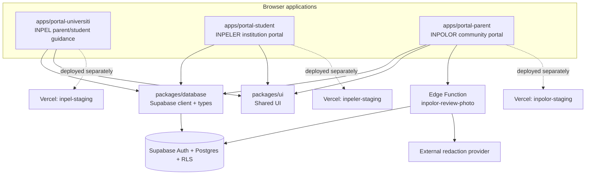
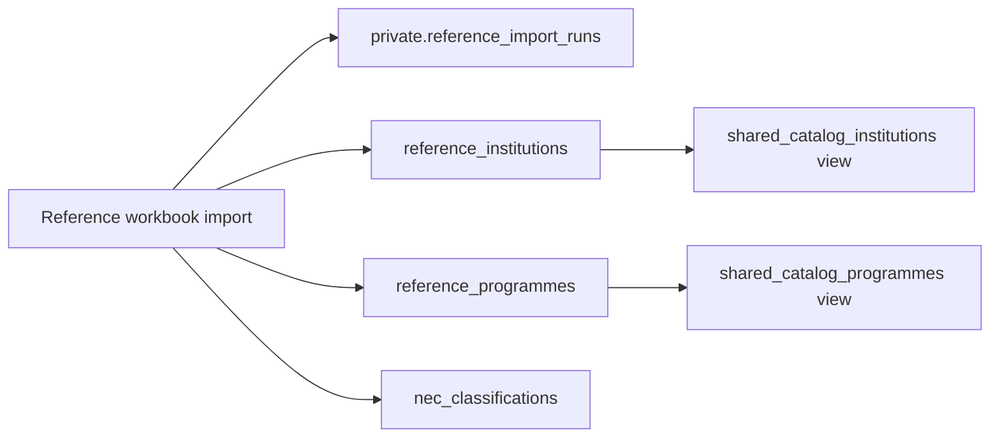
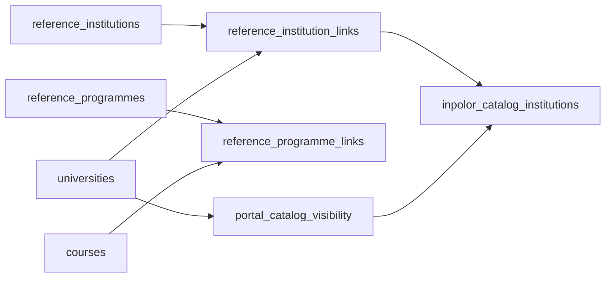
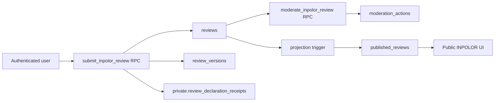
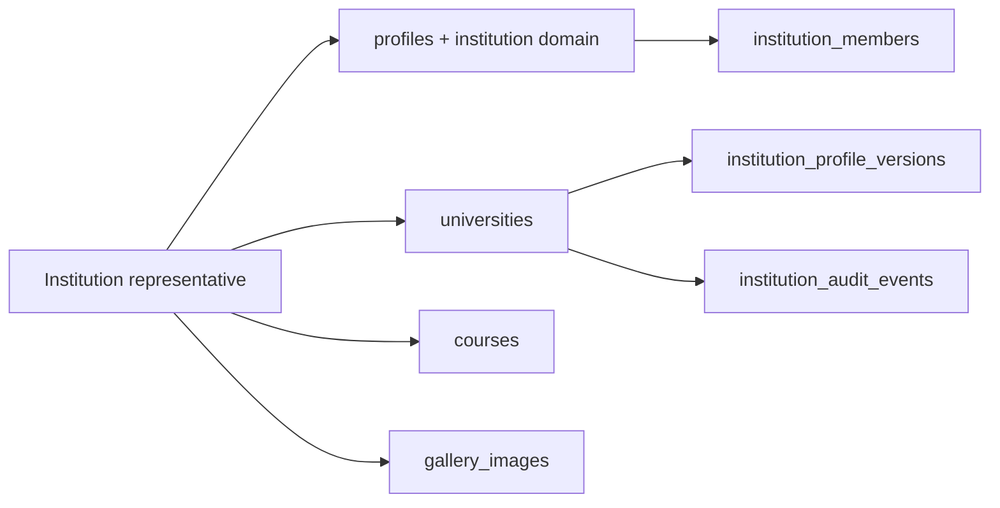
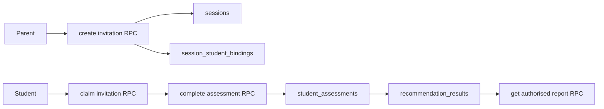
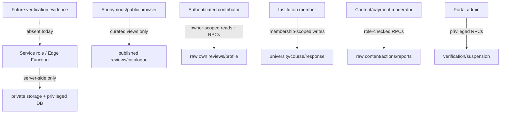
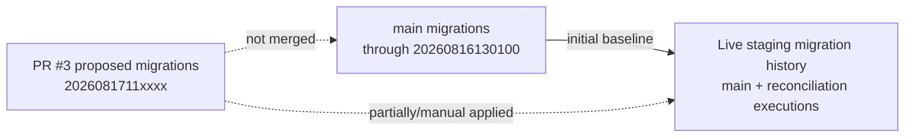

# Phase 0 System Architecture Map

**Baseline:** `main` at `5d2b00452755c276144baf73648b2c06569039db`  
**Live backend:** Supabase project `xrmrhjgkttxzvwdsjazs`  
**Scope:** Current architecture only. Proposed changes are described separately in [`00F_PROPOSED_TARGET_ARCHITECTURE.md`](./00F_PROPOSED_TARGET_ARCHITECTURE.md).

## 1. Monorepo map

### Naming mismatch

The workspace names do not match the product names:

| Workspace | Product |
|---|---|
| `portal-universiti` | INPEL |
| `portal-student` | INPELER |
| `portal-parent` | INPOLOR |

This is not a runtime defect, but it increases contributor and deployment configuration risk.

## 2. Current application boundaries

### INPEL

Responsibilities:

- parent preference capture;
- authenticated student invitation;
- student assessment;
- secure report access;
- reference institution/programme discovery;
- results/report presentation.

Primary data:

- `profiles`
- `sessions`
- `session_student_bindings`
- `student_assessments`
- `recommendation_results`
- `report_access_grants`
- reference catalogue views

Trust boundary:

- browser drafts contain family and assessment data;
- direct writes are mostly prevented by RLS;
- RPCs own invitation, claim, assessment completion, and report access.

### INPELER

Responsibilities:

- institutional authentication;
- institution profile composition;
- programme and facility entry;
- image upload;
- readiness review;
- publication.

Primary data:

- `universities`
- `courses`
- `gallery_images`
- `institution_domains`
- `approved_institution_domains`
- `institution_members`
- `institution_profile_versions`
- `institution_audit_events`
- reference catalogue views

Trust boundary:

- institution roles can manage only entitled universities;
- the current frontend still inserts a new institution rather than maintaining one;
- public institution assets are stored in a public bucket.

### INPOLOR

Responsibilities:

- institution discovery;
- university profile and review feed;
- authentication and age gate;
- review drafting/submission;
- local contribution history;
- saved universities/reviews;
- comparison;
- legal pages.

Primary data:

- `profiles`
- `reviews`
- `review_versions`
- `review_photos`
- `published_reviews`
- `moderation_actions`
- `content_reports`
- `official_responses`
- `review_unspoken_truths`
- saves, likes, questions, answers, notifications, and reward tables

Trust boundary:

- raw reviews are owner/moderator-only;
- public content is projected into identity-free tables;
- photo originals are stored temporarily in a private bucket, processed server-side, and deleted after a safe derivative is accepted;
- no student-verification evidence boundary exists yet.

## 3. Current data planes

### 3.1 Reference catalogue plane

Purpose:

- preserve external-source identity and provenance;
- support discovery and reconciliation;
- avoid automatically treating source rows as approved public product profiles.

Live state:

- 756 institutions;
- 6,302 programmes;
- no verified product links.

### 3.2 Product catalogue plane

Purpose:

- represent reviewed and managed product records;
- control which portal may publish each record;
- retain reference provenance.

Current limitation:

- no `campuses` or programme-campus offering;
- product `universities` and `courses` are empty;
- INPOLOR frontend currently uses reference identity as if it were product identity.

### 3.3 Community content plane

Current breakpoints:

- payload declaration mismatch before insertion;
- reference ID sent where product university ID is required;
- no student/alumni verification state;
- no scoped entitlement;
- no end-to-end deployed test.

### 3.4 Institution-management plane

Backend membership/version/audit primitives exist. The current frontend does not complete this lifecycle: it creates new rows, does not hydrate existing records, and does not create reviewed reference links.

### 3.5 Family-guidance plane

This is the most server-authoritative portal flow. It remains disconnected from verified programme-campus review intelligence.

## 4. Identity and key map

| Concept | Current key | Intended meaning | Current use problem |
|---|---|---|---|
| External/reference institution | `reference_institutions.id` | Source/provenance record | Used by INPOLOR UI as public product ID |
| Product university | `universities.id` | Managed institution profile | Required by review RPC, but no rows exist |
| External/reference programme | `reference_programmes.canonical_record_id` | Source programme record | Not retained by INPELER draft selection |
| Product course | `courses.id` | Institution-managed programme | No campus/offering context; optional on reviews |
| Portal publication | `(university_id, portal)` | Published/hidden state | No rows exist |
| Review | `reviews.id` | Private/raw contribution | Correctly projected to a separate public table |
| Public review | `published_reviews.id` | Identity-free public representation | Dependent on correct raw review and moderation contracts |
| User identity | `auth.users.id` / `profiles.id` | Authenticated person | One global role restricts cross-portal capabilities |

## 5. Current trust boundaries

### Good boundaries already present

- Raw reviews are not public.
- Public review rows omit `user_id`.
- Institution members do not receive general profile access.
- Sensitive review-photo storage is private.
- Service-role operations are confined to server-side code.
- Moderation actions are recorded.

### Missing or weak boundaries

- No separate verification identity/evidence store.
- Global profile role combines identity and capability.
- Base product tables allow broad public reads.
- Local browser storage has no coordinated retention/clear policy.
- No analytics boundary exists, so prohibited event properties are not technically enforced.

## 6. Storage and external services

### Storage buckets

| Bucket | Visibility | Purpose | Current risk/posture |
|---|---|---|---|
| `inpolor-review-photos` | Private | Reward-review photos and safe derivatives | Good private baseline; depends on external redaction provider availability |
| `university-assets` | Public | Logos/facility/gallery assets | Appropriate for public institution content, but source/rights validation remains operational |

### INPOLOR photo Edge Function

Current behaviour:

- validates bearer token manually;
- validates file signature and MIME;
- enforces 5MB limit;
- calls an external redaction provider;
- strips metadata from JPEG/PNG/WebP;
- stores a safe derivative;
- deletes the original;
- produces 10-minute signed URLs;
- checks draft ownership for contributor operations;
- permits public preview only for published photo projections.

The deployed function is configured with `verify_jwt=false`, so manual authentication and every ownership check are security-critical and require dedicated tests.

## 7. Database deployment and drift map

Consequences:

- a fresh database built from `main` does not equal live staging;
- main pgTAP expectations are stale;
- PR #3 contains some correct intent but is based on an older main and differs from live policies;
- a blind `supabase db push` can create duplicate or conflicting operations;
- source-of-truth convergence must precede new schema design.

## 8. Deployment and CI map

| Layer | Current implementation | Evidence level |
|---|---|---|
| Application CI | Typecheck, lint, unit/component tests, workspace build | Automated on push/PR |
| Local database CI | Supabase start/reset + pgTAP | Automated, currently affected by stale main tests |
| Remote integration | Disposable staging audit workflow | Manual only |
| Browser E2E | None found | Absent |
| Vercel deploy | Three separate staging projects | Build/deploy status green for audited main |
| Runtime logs/visual inspection | Protected-team access required | Incomplete in current connector |

## 9. Current architecture strengths

- Shared repository and database package reduce uncontrolled duplication.
- Reference and product catalogues are conceptually separated.
- Portal-specific publication visibility is present.
- Public review projection is separate from raw review storage.
- Institution membership, audit, moderation, and report primitives exist.
- Photo processing is designed around private originals and safe derivatives.
- INPEL invitation/assessment/report journeys are server-authoritative.

## 10. Current architecture constraints

- No canonical campus and offering hierarchy.
- No private verification/evidence domain.
- No capability-based identity model.
- Review content is partly structured and partly opaque JSONB.
- Global unlock is not scoped or revocable.
- Repository and live database are divergent.
- Frontend/service contracts are duplicated as unshared string literals.
- No privacy-safe analytics service boundary.
- No operational admin surfaces for the backend’s breadth.

## 11. Architecture handoff

The next architecture step is not to rename all legacy tables immediately. It is to:

1. converge main, staging, migrations, RPCs, and frontend contracts;
2. prove one complete standard-review lifecycle;
3. introduce the canonical institution-campus-programme-offering hierarchy additively;
4. introduce private verification/evidence tables and scoped entitlements;
5. dual-read/dual-write during migration;
6. cut over public pages only after backfill, RLS, moderation, confidence, and rollback tests pass.
