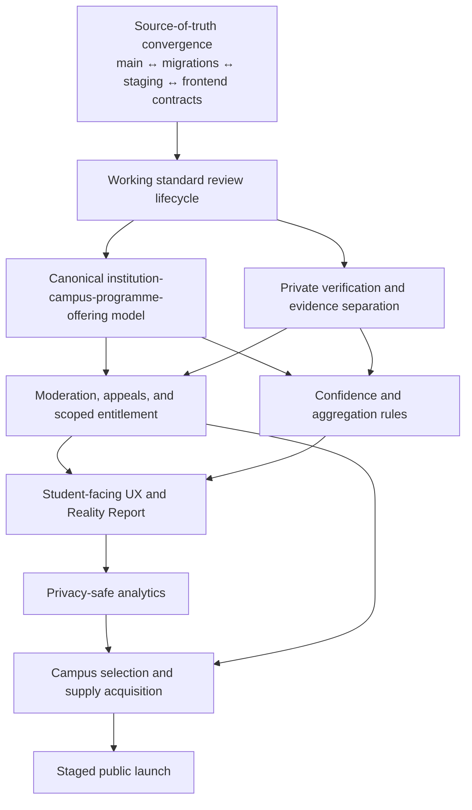

# Phase 0 Dependency Map

**Purpose:** Define the order in which INPOLOR relaunch work can safely proceed and identify dependencies that cannot be bypassed with UI work.

## 1. Critical dependency chain



### Why this order is mandatory

- A homepage cannot truthfully display programme-campus evidence before canonical records and confidence rules exist.
- Verification cannot be marketed before identity/evidence storage and access controls exist.
- Review acquisition must not scale before moderation and reporting operations are usable.
- Analytics cannot be added casually because review text, verification evidence, identity, and small-cohort attributes are prohibited from events.
- Campus launch selection requires real access/supply evidence, not prestige-based guesses.

## 2. Immediate P0 dependency: source-of-truth convergence

Current state:

- `main` contains the official directive but not the critical-contract fixes.
- PR #3 contains 29 changed files and several valuable fixes, but it is based on an older `main`.
- Live staging already contains manually applied or reconciled versions of some PR #3 changes.
- Live staging expects a declaration payload that neither `main` nor PR #3 sends.
- Live policies differ from the broad policies proposed in PR #3.
- `private.reference_import_runs` still lacks RLS despite a proposed PR #3 migration.

Dependency decision:

> Do not merge PR #3 wholesale. Recreate the smallest verified foundation on a fresh branch from current `main`, using live schema evidence and regression tests as the contract.

## 3. Cross-portal dependency map

| Dependency | Producer/owner | Consumers | Current gap | Required resolution |
|---|---|---|---|---|
| Reference institution identity | Import pipeline / Supabase | INPEL, INPELER, INPOLOR | Treated as product identity by INPOLOR | Preserve only as provenance/discovery key |
| Product institution identity | INPELER / admin | INPEL, INPOLOR | No product rows or verified links | Create reviewed product records and links |
| Campus identity | Future canonical catalogue | All portals | Absent | Add canonical campus entity and source mapping |
| Programme identity | Reference catalogue + INPELER | INPEL, INPOLOR | Free-text/product `courses` not consistently linked | Add canonical programme and offering mapping |
| Programme-campus offering | Institution data layer | INPEL, INPOLOR | Absent | Add offering entity with fees, mode, intake, status |
| Student verification | INPOLOR trust operations | Public review labels, moderation, entitlements | Absent | Private verification case/evidence architecture |
| Review confidence | Aggregation service/view | Public pages, INPEL guidance | Only simple university averages | Define verified, sample-size, recency, and cohort rules |
| Institution response | INPELER membership + moderation | INPOLOR public review | Backend exists, no operational UI | Build member-authorised response workflow |
| Shared user capability | Auth/profile layer | All portals | Single global role | Introduce additive capability/membership model |
| Analytics event contract | Analytics service | Product/growth/QA | Absent | Define privacy-safe schema before instrumentation |

## 4. Data dependencies

### 4.1 Canonical hierarchy dependencies

```text
reference source
  → institution reconciliation
  → product institution
  → campus
  → canonical programme
  → programme-campus offering
  → portal publication visibility
  → review target
  → public aggregate
```

A review must target a stable programme-campus offering or, during transition, a valid product institution with an explicit provenance record. It must never target an unreviewed reference row as if that row were a public product profile.

### 4.2 Verification dependencies

```text
user consent
  → verification case
  → verification method
  → private evidence
  → reviewer decision
  → minimum retained status/audit metadata
  → public verification label
  → contribution entitlement
```

Public review content must not carry raw evidence metadata, reviewer email, exact evidence timestamps, document paths, or internal verification notes.

### 4.3 Moderation dependencies

```text
submitted review
  → deterministic quality checks
  → verification result
  → moderation queue
  → moderator decision + audit
  → published projection
  → entitlement grant/revoke
  → aggregate refresh
  → notification
```

Current backend jumps directly from submitted/pending to published and uses a global boolean unlock. The target lifecycle requires explicit intermediate states and a revocable entitlement.

## 5. External dependencies

| External dependency | Current use | Risk | Required control |
|---|---|---|---|
| Supabase Auth | All portals | Single-role model; leaked-password protection disabled | Capability model, auth hardening, role tests |
| Supabase Postgres/RLS | All product data | Repo/live drift; many privileged RPCs | Migration reconciliation and per-RPC tests |
| Supabase Storage | Institution assets and review photos | Public institution assets; private evidence architecture absent | Bucket classification, retention, signed-URL rules |
| Supabase Edge Functions | Review-photo processing | `verify_jwt=false`; manual auth is critical | Dedicated function tests, rate limits, observability |
| External redaction provider | Reward photo privacy | Availability, processing quality, provider trust | DPA/security review, fail-closed behaviour, audit metadata |
| Vercel | Three portal deployments | Current connector cannot inspect owning team previews | Team access/share URL for browser verification |
| Reference/MQA workbook | Catalogue provenance | Historical/duplicate variants and uncertain campus context | Source versioning, reconciliation rules, manual review |
| Malaysian legal counsel | Privacy, defamation, evidence, minors | Legal documents are explicitly draft | Counsel-approved terms/notices before public collection |
| Campus societies/alumni | Initial review supply | No verified access data supplied | Evidence-based campus shortlist and accountable owner |

## 6. Phase dependencies and gates

### Foundation Milestone 0 — Source-of-truth convergence

**Dependencies:** Official directive and Phase 0 audit.  
**Gate:** One standard review passes through an isolated, cleaned lifecycle test.  
**Blocks:** Every other runtime relaunch milestone.

### Phase 1 — Product and trust decisions

**Dependencies:** Foundation review contract is coherent; Phase 0 evidence.  
**Outputs:** Product strategy, relaunch scope, trust model, four-step review flow, analytics design.  
**Gate:** Orchestrator resolves product/trust/data conflicts.

### Phase 2 — Data and backend foundation

**Dependencies:** Approved product/trust decisions.  
**Outputs:** Canonical hierarchy, private verification, moderation lifecycle, scoped entitlements, aggregation confidence, migration/rollback plan.  
**Gate:** RLS and migration tests pass on a disposable database.

### Phase 3 — Frontend implementation

**Dependencies:** Stable backend contracts and feature flags.  
**Outputs:** Search, institution/campus/programme pages, four-step review, verification, Reality Report, analytics.  
**Gate:** Mobile accessibility and end-to-end tests pass.

### Phase 4 — Operations

**Dependencies:** Verification and moderation schemas.  
**Outputs:** Verification queue, moderation queue, reports, appeals, institution response, audit tools.  
**Gate:** Named operating owners and tested role boundaries.

### Phase 5 — Growth preparation

**Dependencies:** Working trust pages, moderation, analytics, and first useful campus pages.  
**Outputs:** Campus selection, ambassador programme, society outreach, SEO, referral loop.  
**Gate:** No paid scaling until density and conversion are measurable.

### Phase 6 — Staged release

**Dependencies:** All critical gates above.  
**Outputs:** Internal test → invited users → one campus → three campuses.  
**Gate:** No critical/high issue, usable rollback, legal sign-off, and operational capacity.

## 7. Dependency conflicts to resolve

### PR #3 versus current main

- PR #3 fixes several known defects.
- It also contains policy choices that differ from live staging.
- It does not fix the live declaration mismatch.
- Its tests are useful evidence and should be selectively ported.

**Resolution:** Supersede it with a fresh, focused foundation branch after preserving attribution and test intent.

### Breadth versus density

- The reference catalogue supports hundreds of institutions and thousands of programmes.
- Public product records and reviews are zero.

**Resolution:** Keep the reference catalogue available for controlled reconciliation, but publish only selected programme-campus profiles that meet launch and confidence gates.

### Review value versus verification friction

- Account/DOB currently occurs before the contributor sees a clear trust/value exchange.
- Verification is absent, so reducing friction without a trust model would create low-quality supply.

**Resolution:** Phase 1 must define the precise sequencing of review writing, account creation, and verification. Do not optimise form conversion before the trust contract is explicit.

### Public anonymity versus useful filters

- Programme, year, nationality, intake, and specialisation improve decision value.
- Combined precision can identify a small cohort.

**Resolution:** Store necessary private context, but apply configurable cohort thresholds and generalisation before public display or analytics.

## 8. True blockers

| Blocked decision/work | Exact blocker | Work that can continue | Smallest resolution |
|---|---|---|---|
| Select first three campuses | No relationship/access evidence | Build platform foundation and selection rubric | Provide shortlist plus access owner/evidence |
| Publish final legal contract | Legal controller and counsel review incomplete | Internal/staging work and legal checklist | Company details and qualified Malaysian review |
| Perform protected-preview browser verification | Current connector lacks owning Vercel scope | GitHub/Supabase/local tests | Grant team access or provide temporary share URL |
| Publicly collect reviews | No verified moderation/verification operations | Build/test queues and policies | Name operating owners and staffing capacity |
| Measure conversion | No analytics or live traffic data | Define event contracts and dashboards | Instrument after privacy review |

## 9. Work that must not be parallelised prematurely

Do not independently implement the following before their upstream decisions are final:

- campus/programme routes before canonical IDs;
- public ratings before confidence logic;
- verification UI before evidence/storage/RLS policy;
- Reality Report before entitlement rules;
- ambassador rewards before fraud and sentiment-neutral rules;
- SEO indexing before density/noindex rules;
- institution response UI before membership and moderation contracts.

## 10. First handoff

The immediate implementation handoff is [`00G_FIRST_FOUNDATION_MILESTONE.md`](./00G_FIRST_FOUNDATION_MILESTONE.md). The milestone owns the source-of-truth convergence dependency and must close it before the wider relaunch branches are opened.
