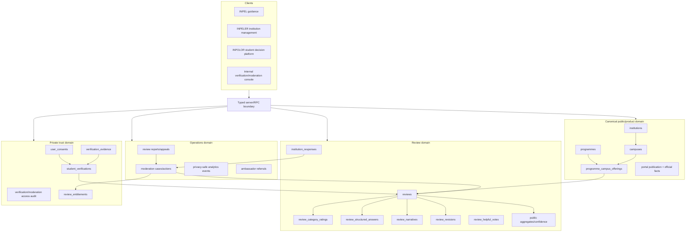
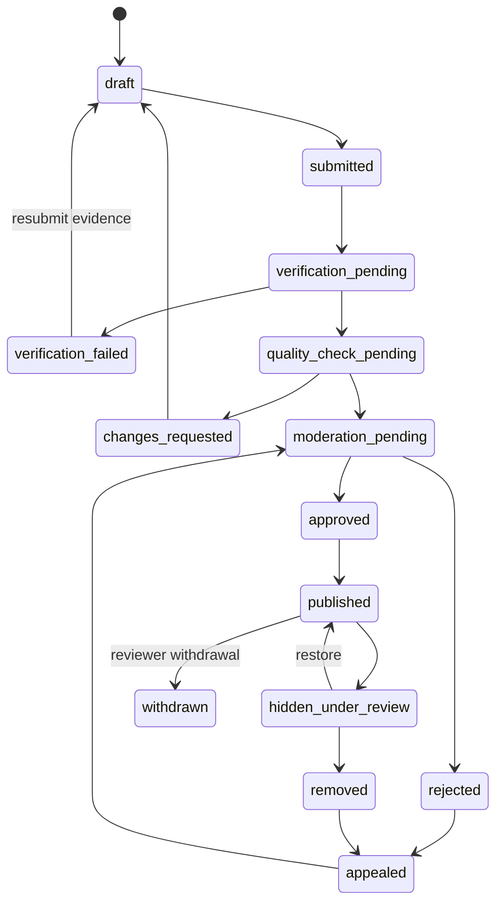

# Phase 0 Proposed Target Architecture

**Status:** Proposed foundation architecture. Detailed Phase 1/2 product, trust, data, RLS, migration, aggregation, and UX specifications remain required before production implementation.

## 1. Target architecture principles

1. One canonical institution-campus-programme-offering model serves INPEL, INPELER, and INPOLOR.
2. Reference-source records remain provenance, not public product identity.
3. Student verification identity/evidence is private and separated from public review content.
4. Public pages consume curated projections, never raw identity/evidence tables.
5. Major review fields are normalized when they require filtering, aggregation, moderation, or reporting.
6. Entitlements are explicit, scoped, time-aware, and revocable.
7. Every privileged transition is server-authoritative and auditable.
8. Public aggregates are confidence-gated and privacy-aware.
9. Major relaunch functions are feature-flagged by institution, campus, programme, role, or test cohort.
10. Migrations are additive and reversible until cutover is proven.

## 2. Target platform map



## 3. Canonical catalogue model

### 3.1 `institutions`

Represents the legal/brand institution identity used across portals.

Suggested responsibilities:

- canonical name;
- institution type;
- official website/domain;
- public verification/status;
- official-source timestamps;
- publication state;
- active/suspended lifecycle.

### 3.2 `campuses`

Represents a distinct physical or delivery campus.

Suggested responsibilities:

- institution ID;
- campus name and stable slug;
- location/address/geographic region;
- active status;
- public-source metadata;
- privacy-safe search fields.

### 3.3 `programmes`

Represents the canonical academic programme concept.

Suggested responsibilities:

- programme name;
- qualification level;
- field/NEC classification;
- MQA/reference provenance;
- aliases/historical names;
- active status.

### 3.4 `programme_campus_offerings`

Represents the actual review and decision target.

Suggested responsibilities:

- institution, campus, and programme IDs;
- delivery/study mode;
- intake/effective period;
- duration;
- MQA/accreditation link;
- tuition, registration, deposit, material fees;
- PTPTN/scholarship indicators;
- institution-supplied and source timestamps;
- portal publication/feature-flag state.

### 3.5 Reference provenance

Existing reference tables should map to canonical entities through reviewed link tables. The mapping must support:

- source record ID;
- canonical target ID;
- match method;
- status;
- reviewer;
- reviewed timestamp;
- notes;
- effective/historical context.

Do not overwrite source rows to force them into a canonical shape.

## 4. User and capability model

### Current limitation

`profiles.role` permits only one global role and mixes identity with authorisation.

### Target approach

Keep `profiles` for account-level attributes and introduce additive capabilities/memberships, for example:

```text
user_capabilities
- user_id
- capability
- scope_type
- scope_id
- status
- granted_by
- granted_at
- revoked_at
```

Examples:

- community contributor;
- verified current student;
- verified alumni;
- content moderator;
- verification reviewer;
- payment operator;
- portal administrator;
- institution representative/admin scoped through institution membership.

The existing role can remain during transition but must not be the only source for new relaunch authorisation.

## 5. Private verification architecture

### 5.1 `student_verifications`

Stores the case and minimum decision metadata:

- user ID;
- institution/campus/programme context;
- claimed student/alumni status;
- method;
- status;
- submitted/decided timestamps;
- reviewer;
- reason code;
- retention policy/version;
- public label eligibility;
- revoked/expired state.

### 5.2 `verification_evidence`

Private-only records:

- verification case ID;
- private storage path;
- evidence type;
- encrypted/checksum metadata as appropriate;
- redaction/processing status;
- uploaded/last-accessed/deletion timestamps;
- retention deadline;
- evidence-access audit relationship.

### 5.3 Access model

- contributor: own case status and safe explanation, not internal notes;
- verification reviewer: explicitly assigned/authorised cases;
- portal admin: controlled oversight;
- institution member: no access;
- public/anonymous: no access;
- analytics: no evidence or identity fields.

### 5.4 Public projection

Public review receives only a coarse label such as:

- Verified Current Student;
- Verified Alumni;
- Verified Recent Student;
- Verification Pending, if pending content is ever shown;
- Unverified Experience, only if product policy permits it.

Exact method, evidence, email, reviewer, and timestamps remain private.

## 6. Review domain

### 6.1 `reviews`

Stores ownership and lifecycle, not the whole review as one payload:

- owner user ID;
- programme-campus offering ID;
- verification case ID;
- contributor status and private context;
- review status;
- submitted/published/withdrawn timestamps;
- acquisition/referral IDs;
- current revision;
- public anonymity setting fixed by policy;
- moderation/quality version.

### 6.2 `review_category_ratings`

One row per review/category:

- category code;
- numeric rating;
- not-applicable flag;
- schema version.

This supports safe filtering and new categories without adding many nullable columns.

### 6.3 `review_structured_answers`

Stores filterable answers such as:

- would choose again;
- worth the fees;
- monthly spending range;
- hidden-fee indicator;
- workload range;
- internship/career-support assessment;
- accommodation/commute mode;
- up to three Green Flags;
- up to three Red Flags.

### 6.4 `review_narratives`

Stores the small number of optional written prompts separately:

- best part;
- biggest watch-out;
- what I wish I knew;
- suggested/approved title;
- moderation/redaction metadata.

### 6.5 `review_revisions`

Every user edit creates an immutable revision or version record. The public projection points to the approved revision.

### 6.6 Helpful votes

Use a unique relationship, not only a denormalized counter:

```text
review_helpful_votes
- review_id
- user_id or privacy-safe subject
- created_at
unique(review_id, user_id)
```

Counters may be transactionally maintained for read performance.

## 7. Review lifecycle

Proposed lifecycle:



The exact state set is a Phase 1/2 decision, but verification, quality, moderation, appeals, withdrawal, and public visibility must be distinguishable.

## 8. Scoped entitlement model

Replace `has_unlocked_tea` with a table such as:

```text
review_entitlements
- user_id
- entitlement_type
- institution_id
- campus_id
- programme_id or offering_id
- source_review_id
- status
- granted_at
- expires_at
- revoked_at
- reason_code
```

### Candidate rule

- provisional access after verification succeeds and deterministic quality minimums pass;
- full access after moderation approval/publish;
- revoke if evidence is fraudulent, review is copied/rejected/removed, or policy is violated;
- preserve audit history.

The exact public preview versus unlocked value balance must be approved in Phase 1.

## 9. Moderation and reports architecture

Use explicit cases and actions rather than only direct row-status updates.

Suggested concepts:

- moderation case;
- content target;
- queue and priority;
- quality flags;
- verification relationship;
- assigned moderator;
- decision and reason code;
- public explanation;
- appeal case;
- institution factual-correction request;
- reviewer withdrawal/update;
- immutable action audit.

Polymorphic report targets require server validation because relational foreign keys cannot cover every content type in one column pair.

## 10. Public projection and confidence architecture

Public pages should read from curated views/materialized projections that already enforce:

- only approved, published, non-removed reviews;
- identity and evidence exclusion;
- cohort generalisation;
- programme-campus grouping;
- review count and recency;
- current-student/alumni distribution only when safe;
- confidence label;
- category suppression below threshold;
- no headline score below the approved minimum;
- official information separated from student-reported information.

Suggested confidence inputs:

- verified approved sample size;
- review recency;
- programme coverage;
- current-student/alumni mix;
- concentration/duplicate risk;
- cohort privacy threshold.

The calculation and thresholds must be versioned and documented.

## 11. Analytics architecture

### Typed allow-list

Create a single analytics client/service with event-specific schemas. Every event validates:

- event name;
- trigger context;
- anonymous/session/user state;
- canonical institution/campus/programme/offering IDs;
- source/campaign/referral;
- device class;
- approved aggregate properties.

### Explicitly prohibited properties

- raw email;
- personal names;
- review text;
- verification document/evidence metadata;
- student ID;
- signed URL/storage path;
- exact sensitive cohort combinations;
- moderator internal notes.

### Storage/provider decision

Use the existing stack where possible. If no suitable analytics stack exists, Phase 1 must compare a privacy-conscious hosted provider versus a first-party `analytics_events` design before installing anything.

## 12. Server/API boundary

Do not rely on direct browser writes for privileged transitions.

Recommended service/RPC groups:

- catalogue reconciliation and publication;
- institution membership/profile maintenance;
- review draft/submission/revision/withdrawal;
- verification case/evidence management;
- deterministic quality checks;
- moderation decision/appeal;
- scoped entitlement grant/revoke;
- institution response submission/moderation;
- report submission/resolution;
- public projection/aggregate refresh;
- privacy-safe event capture.

Every privileged function must:

- validate auth and capability;
- validate input and target existence;
- use a fixed empty `search_path` or invoker semantics;
- minimize grants;
- record audit events;
- be covered by positive and prohibited-access tests.

## 13. Feature flags and staged activation

Feature flags should support:

- internal users only;
- invited contributor cohort;
- one institution/campus;
- selected programme offerings;
- moderator/verification roles;
- public search/indexing;
- review submission;
- verification methods;
- Reality Report entitlement;
- institution responses;
- referrals/ambassadors.

Flags must be server-enforced for sensitive features, not only hidden in the UI.

## 14. Migration strategy

### Stage 0 — Converge existing source of truth

- align frontend/server declaration and ID contracts;
- reconcile live migration history and main;
- prove standard review lifecycle;
- close or supersede PR #3.

### Stage 1 — Add canonical hierarchy

- create institutions/campuses/programmes/offerings additively;
- preserve existing university/course IDs through mapping tables;
- build reconciliation/admin tools;
- no destructive cutover.

### Stage 2 — Add private verification and entitlements

- private tables/buckets/policies;
- consent and retention controls;
- server APIs and access audit;
- no public display until tests pass.

### Stage 3 — Normalize review content

- add ratings/answers/narratives/revisions;
- dual-write from the new flow;
- backfill eligible legacy reviews;
- compare public projections.

### Stage 4 — Cut over public reads

- feature-flag selected programme-campus pages;
- confidence/noindex rules;
- old university-only views remain fallback during validation.

### Stage 5 — Retire legacy paths

- remove obsolete JSON keys, global unlock, and unused status paths only after data and rollback windows are complete.

## 15. Rollback architecture

Every migration milestone requires:

- pre-change schema/data snapshot or backup;
- additive migration where possible;
- feature flag default-off;
- reverse migration or documented forward-fix path;
- dual-read validation;
- no destructive drop until a later release;
- explicit data-retention handling;
- tested restoration of the previous public projection.

## 16. Unresolved decisions

The following are intentionally not finalised in Phase 0:

- first three campuses;
- allowed verification methods;
- evidence retention duration;
- provisional versus post-approval unlock timing;
- exact entitlement scope/expiry;
- confidence formula and review recency window;
- whether unverified experiences are accepted at all;
- analytics provider;
- comment retention/public policy;
- legal controller details and final terms;
- whether legacy `universities/courses` are renamed or retained behind canonical views.

## 17. Architecture acceptance gate

Before Phase 2 migrations are approved, the detailed design must demonstrate:

- one canonical offering ID across all portals;
- institution roles cannot discover reviewer identity/evidence;
- contributors can access only their own verification status;
- moderators have explicit, audited access;
- approved public projections contain no prohibited identity/evidence fields;
- confidence and cohort rules are versioned;
- migration/backfill/rollback paths are realistic;
- integration and RLS tests cover every major role;
- no production destructive operation is required for initial rollout.
